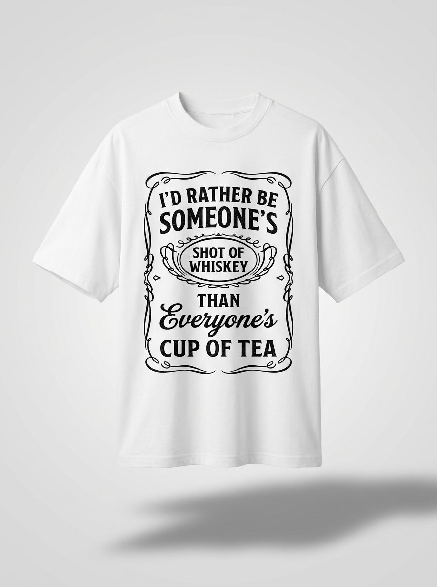

# PHENOMENAL — *Shot of Whisky* Tee

A polished, single-page e-commerce storefront for **PHENOMENAL**, featuring the
flagship product: the **SHOT OF WHISKY** oversized tee —
*"I'd rather be someone's shot of whiskey than everyone's cup of tea."*



## Features

- **Premium dark / whiskey-amber design** with elegant Playfair Display + Pinyon Script typography.
- **Cinematic hero** backed by a generated whiskey-glass photograph.
- **Full product experience** — image gallery with thumbnails, color swatches, size
  selector, quantity stepper, and a live size-guide modal.
- **Working cart** — slide-out drawer, quantity editing, line totals, subtotal, and
  `localStorage` persistence across page loads.
- **Conversion sections** — story, feature highlights, social-proof reviews, FAQ
  accordion, animated marquees, and newsletter capture.
- **Scroll-reveal animations**, sticky blurred nav, and a fully **responsive**
  mobile layout with off-canvas menu.
- **Accessible & resilient** — reduced-motion support, keyboard (Esc) handling,
  and SVG fallbacks for every product image.

## Tech

Pure, dependency-free **HTML + CSS + vanilla JavaScript** — no build step required.
Google Fonts for typography. Product, lifestyle, and hero imagery were generated to
match the source product and optimized for the web.

## Run locally

```bash
python3 -m http.server 8000
# then open http://localhost:8000
```

## Structure

```
index.html                 # the full storefront
assets/css/styles.css      # theme, layout, components, responsive rules
assets/js/main.js          # gallery, options, cart, drawer, modal, reveals
assets/img/                # product / lifestyle / hero images + SVG fallbacks
```
